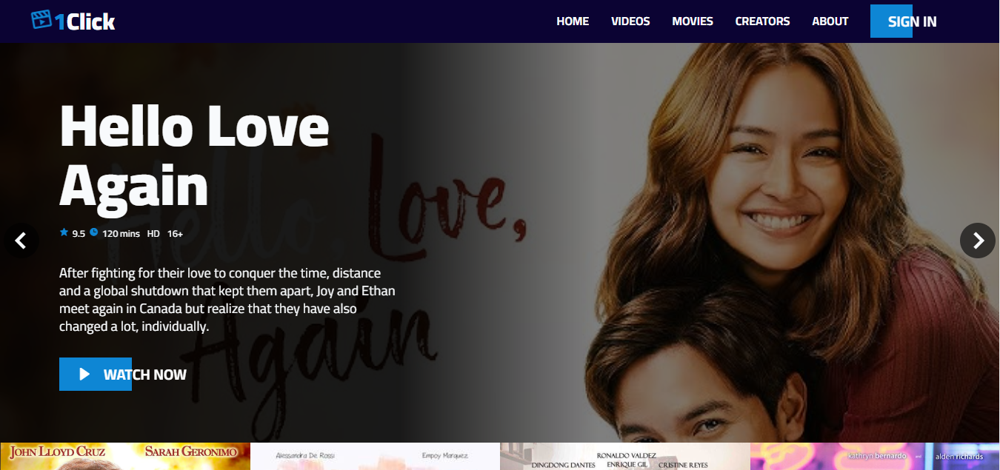
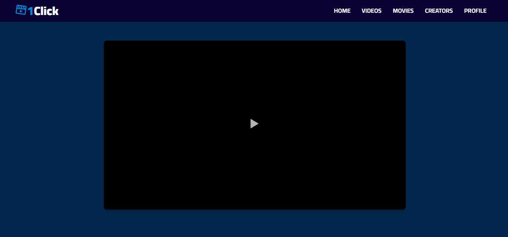
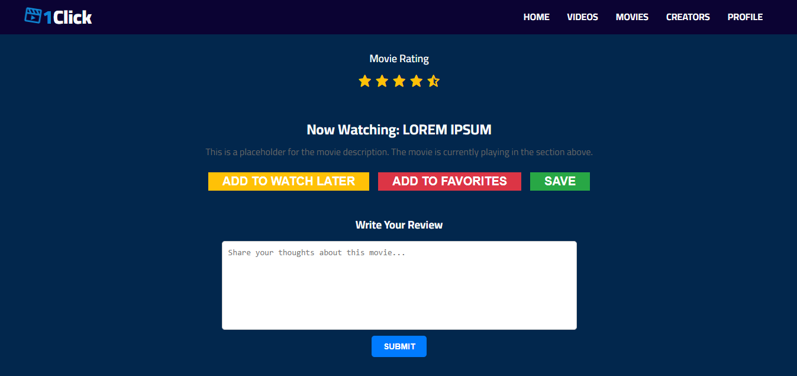
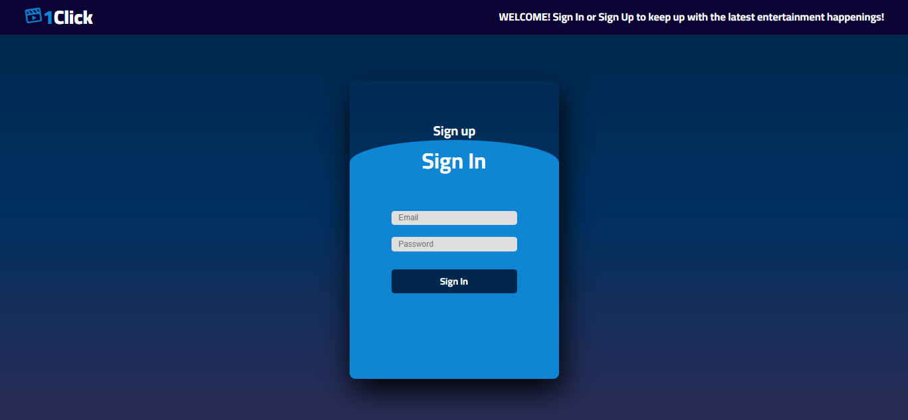
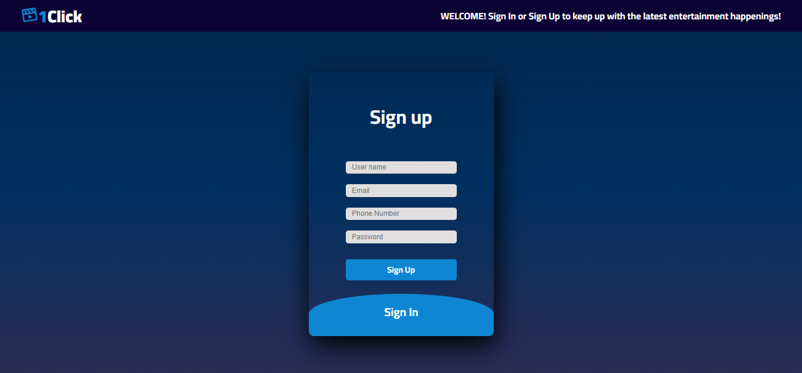
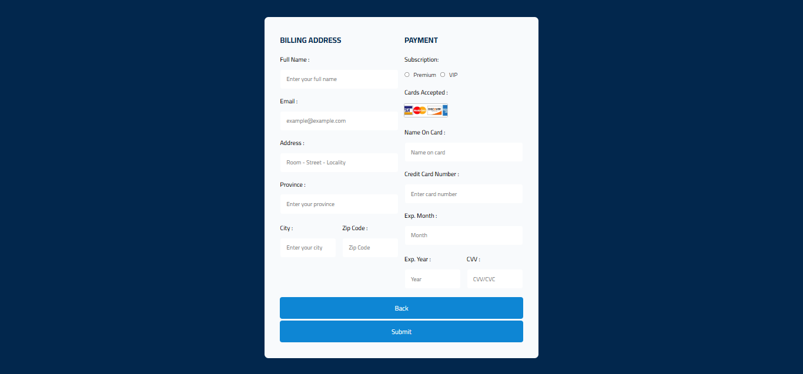

# 🎥 1Click - Online Streaming Platform

Welcome to **1Click**, an all-in-one online streaming platform that allows users to watch movies, vlogs, live shows, gameplay, and any video they desire! This platform also enables users to interact with and subscribe to their favorite content creators.

---

## 📝 Project Description
**1Click** is designed to simulate a full-featured streaming platform with a focus on an intuitive and visually appealing user interface. While it currently uses only frontend technologies, the UI effectively demonstrates how the platform would appear and operate.

---

## 🖥️ Technologies Used
- **HTML** - Structuring the web pages
- **CSS** - Styling the platform
- **JavaScript** - Adding interactivity

---

## 📸 Project Snapshots
### Homepage Preview

### Watch Now Page

### Sign In and Sign Up

### Subscription Page

---

## 🚧 Important Note
🔴 This project **only uses frontend technologies**. It is not functional and serves as a demonstration of how the platform's user interface would appear.

---

## 📢 Feedback & Contributions
💡 If you have any suggestions or improvements, feel free to submit a pull request or open an issue!

---

